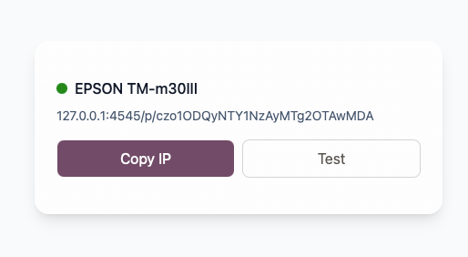
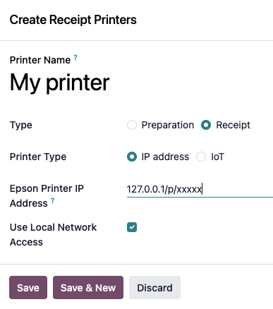

# ePOS Proxy

A lightweight desktop app that exposes your USB Epson printer as a local HTTP endpoint, making it compatible with Odoo Point of Sale.

## Installation

### Download

Download the latest release for your platform from the [Releases](../../releases) page.

## Usage

- Connect your printer via USB to your computer
- Launch ePOS Proxy - the application will detect your printer automatically



- Copy the printer address shown in the UI
- Configure Odoo Point of Sale to use this address 



-  Paste the printer IP in the "Epson Printer IP Address" field.
-  Check Use Local Network access option
-  Save and open your POS session


### Linux

Before running the application, you may need to make it executable and install a required dependency.
```bash
sudo apt update
sudo apt install libwebkit2gtk-4.1-0
```

